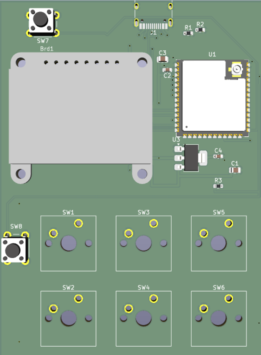

# The GacroPad

> 

A six-key macro pad that plugs into a PC as a USB keyboard, with a small OLED for whatever you feel like showing it. Time, stats, whatever. If it doesn't have it, make it.

I made this because I play Roblox. Roblox is very weird. Some games are intense, and some are calmer. If you couldn't tell, I play intensely. I also listen to music. Can you REALLY switch between music and being in the middle of a chase sequence? No. No you can't. This is why I built the GacroPad. I also need macros for some things, limited to, but not excluding:

- Complicated actions 
- Die of Death
- Soundboard

The screen helps in a way because I can see the time when I'm in a heavy chase and I can't hit F11 without getting myself hit in a chase.

---

The repo has two halves: the firmware that runs on the pad, and a GTK4 companion app. The pad is good itself. The companion app is the real business, but the firmware is where all the magic happens. The companion app is cooler, I swear on my life.

## The hardware

It's built around an **ESP32-S3-WROOM-1U**:

- a 1.3" SSD1306 128x64 I2C OLED (the address is probed at boot, so `0x3C` and `0x3D` both work)
- native USB, but \* 2: TinyUSB HID for the keyboard and media keys, and a CDC port for talking to the companion app.

Macros can send ordinary keystrokes, raw HID usages, media keys, text, and delays. They're stored in NVS, so they survive power cycles and reflashes. If that is one of your worries, let them be free!

## Building the firmware

```bash
pio run
```

That gives you `firmware.bin`, which is only the application. A _first_ flash over the ROM bootloader kinda needs the whole thing, so instead run this:

```bash
pio run -t mergedbin
```

That writes `.pio/build/gacropad/gacropad.bin`, which includes the bootloader, partition table, and app, ready to flash at offset `0x0`.

### Flashing

There's buttons. On the PCB. One is BOOT. One is RESET. Hold BOOT, and then hit RESET. After, you can flash it through various ways, but my favorite is esptool. For the sake of time, I will only place that.

```bash
esptool.py --port /dev/ttyUSB0 write_flash 0x0 .pio/build/gacropad/gacropad.bin
```

## The companion app

GTK4, via PyGObject, which means it wants the system Python:

```bash
sudo apt install python3-gi gir1.2-gtk-4.0
pip install -r companion/requirements.txt
cd companion && /usr/bin/python3 main.py
```

A plain venv usually won't have `gi`, which is why we have the `/usr/bin/python3`. The app finds the pad on its own if there's only one, and you should only have one anyway, since 2 is nuts and 3 is a mental health issue.

What it's for:

- Macro editing. Seriously, what else? Click a key to open its editor. Recording captures whatever you do but only while the editor window has focus, because why else? Just write it down on a notepad if you need to remember. This is why it works on Wayland without root. Esc stops. There's a "test fire" button, and presets if you're a baby and you don't like to record.
- OLED modes. `labels` (key names), `clock`, `stats` (CPU and memory), and `live` (two lines of text you control). The live lines are plain text pushed over serial, so anything can be there.

The key buttons push one slot at a time, meanwhile "push all" pushes all six. Of course.

## The serial protocol

Newline-delimited JSON, one request per line, one reply per line. If you're handy, this is maybe useful. _Maybe._ This usually isn't, but if you eventually figure it out, congratulations, you're a nerd.

```
{"cmd":"ping"}
{"cmd":"get","key":0}
{"cmd":"set","key":0,"slot":{"label":"K1","steps":[{"t":"raw","v":104,"hold":40}]}}
{"cmd":"press","key":0}
{"cmd":"oled","mode":"clock"}
{"cmd":"live","clock":"14:32","l1":"hello","l2":"world"}
{"cmd":"stats","cpu":12,"mem":40}
{"cmd":"reset"}
```

Replies always carry `ok`, and an `err` when it's false. The pad also emits unsolicited `{"ev":...}` lines of its own when you press a key.

Macro steps are `delay`, `text`, `media`, `raw`, `key`, `down`, and `up`, where `down` and `up` are for chords, like holding Ctrl and then tapping C.

## CAD files

Well, here's the thing. The case is not done yet. It will be done soon. Trust me, it won't be late. 

## Credits and confessions

Built with [U8g2](https://github.com/olikraus/u8g2) (thank you) and [ArduinoJson](https://github.com/bblanchon/ArduinoJson) (thank you too), and a great deal of beating the hugs out of the ESP32 Arduino HID API until it worked well.

The code comments are better than the actual code, unfortunately. I am not good at programming, or designing, or whatever. If you object, do not.

I have committed many sins (sloth, sloth, sloth, and sloth), and this is unfortunately my penance. This was lazy, but that's fine.
